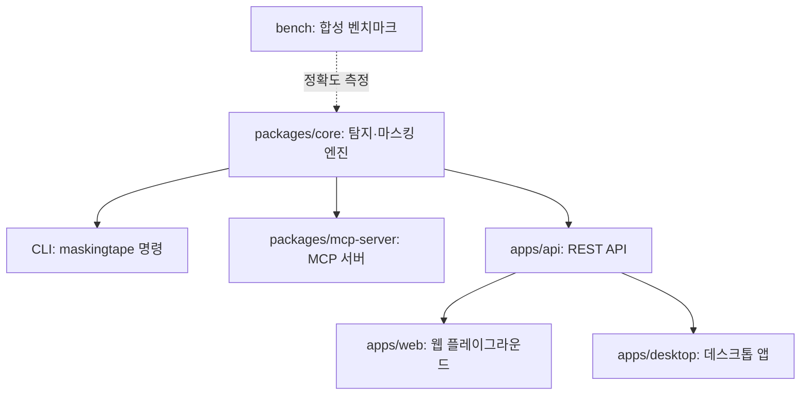

# 마스킹테이프 maskingtape

> 한국어 개인정보 비식별화 오픈소스 엔진 — 규칙 기반 탐지 + 로컬 LLM 문맥 판단 하이브리드

한국어 문서·데이터셋에서 개인정보(주민등록번호·전화번호·주소·이름 등)를 탐지해 마스킹·가명처리하는 **Python 라이브러리 + CLI + MCP 서버**.
AI 에이전트가 한국어 데이터를 다루기 전에 거치는 **프라이버시 계층**을 목표로 한다.

**2026 오픈소스 개발자대회**(과학기술정보통신부 주최·NIPA 주관) 출품작 — 팀 **마스킹테이프** · Apache-2.0

## 왜 maskingtape인가

- **한국어 전용**: 주민등록번호(체크섬 검증 포함)·한국 전화번호·도로명 주소·한국어 이름 등 국내 포맷 특화 — 영어권 도구(Presidio 등)가 못 채우는 갭
- **하이브리드 탐지**: 정규식·사전 규칙(빠름, 결정적) + 로컬 LLM 문맥 판단(인명 vs 상호명 구분 같은 애매한 케이스, 선택 사항)
- **완전 로컬**: 외부 API 호출 없음. LLM도 Ollama 기반 오픈웨이트 모델만 사용 — 개인정보가 밖으로 나가지 않는다
- **규칙 전용 모드**: LLM 없이도 동작 — 저사양 환경에서도 쓸 수 있다
- **MCP 서버**: AI 에이전트 워크플로에 비식별화 계층을 끼워 넣을 수 있다

## 빠른 시작 (개발 중 — API는 바뀔 수 있음)

```bash
git clone https://github.com/ChoHyeonChan/maskingtape.git
cd maskingtape
python -m venv .venv
# Windows: .venv\Scripts\activate / macOS·Linux: source .venv/bin/activate
pip install -e "packages/core[dev]"

maskingtape "주민번호 800101-1234560 문의주세요"
# → 주민번호 ************** 문의주세요

maskingtape --strategy label "연락처 010-1234-5678"        # → 연락처 [전화번호]
maskingtape --scan "주민번호 800101-1234560 문의주세요"   # 탐지 리포트(JSON)만
pytest packages/core                                       # 테스트
```

현재 탐지: **주민등록번호**(체크섬 검증), **전화번호**(휴대폰·유선·070, +82 표기), **이메일**, **주소**(행정구역), **이름**(규칙 + 로컬 LLM 문맥 판단)

라이브러리로 쓰기:

```python
from maskingtape import Pipeline

result = Pipeline().anonymize("주민번호 800101-1234560 문의주세요")
print(result.text)         # 주민번호 ************** 문의주세요
print(result.detections)   # [Detection(kind='rrn', start=5, end=19, ...)]
```

※ 예시의 주민등록번호는 체크섬만 맞춘 **합성 번호**다.

## 정확도 (공개 벤치마크)

저작권·개인정보 걱정 없는 **자체 합성 데이터셋**으로 정확도를 측정한다 — 공개 벤치마크는 이 프로젝트의 핵심 차별화 포인트다. `python -m bench.evaluate bench/datasets/synth_v1.jsonl` 실측:

| 종류 | precision | recall | F1 |
|---|---|---|---|
| 주민등록번호 | 1.000 | 1.000 | 1.000 |
| 전화번호 | 1.000 | 1.000 | 1.000 |
| 이메일 | 1.000 | 1.000 | 1.000 |
| 주소 | 1.000 | 1.000 | 1.000 |
| 이름 (규칙) | 0.890 | 0.847 | 0.868 |
| **전체** | **0.961** | **0.943** | **0.952** |

번호·주소는 형태 규칙으로 완벽히 잡힌다. 이름은 문맥 판단이 필요해 규칙만으로는 한계가 있어(F1 0.868), **로컬 LLM 하이브리드**로 보완한다 — "이용 안내"의 '이용' 같은 오탐을 문맥으로 걸러낸다. (측정: `bench/` 참고)

## MCP 서버로 쓰기 (AI 에이전트용)

에이전트가 한국어 데이터를 외부로 보내기 전에 자동으로 비식별화하는 프라이버시 계층:

```bash
pip install -e packages/core -e packages/mcp-server
claude mcp add maskingtape -- maskingtape-mcp      # Claude Code 등록
```

제공 도구: `scan_text`(탐지 리포트), `anonymize_text`(mask/label 비식별화), `anonymize_file`(로컬 파일을 통째로 비식별화해 사본 저장). 상세: [packages/mcp-server](packages/mcp-server)

## 저장소 구조

모든 탐지·마스킹 로직은 `packages/core` **하나**에 있고, 나머지는 그걸 감싸 쓴다 — 탐지기를 한 번 고치면 모든 표면(CLI·MCP·API·앱)이 함께 좋아진다.



> 웹·데스크톱은 통합 전까지 `apps/api` 대신 core CLI를 직접 호출한다(같은 엔진).

| 경로 | 내용 | 담당 |
|---|---|---|
| `packages/core/` | Python 탐지·마스킹 엔진 + CLI (순수 로직) | 조현찬 |
| `packages/mcp-server/` | MCP 서버 — core를 에이전트 도구로 노출 | 조현찬 |
| `apps/api/` | FastAPI 백엔드 — 웹·데스크톱 공용 | 풀스택 |
| `apps/web/` | 웹 플레이그라운드 (탐지 하이라이트 데모) | 프론트 ×2 |
| `apps/desktop/` | Flutter 데스크톱 앱 (드래그&드롭 배치 처리) | Flutter |
| `bench/` | 합성 벤치마크 데이터 + F1 정확도 리포트 | 데이터 |

## 개발에 참여하기

- **[CONTRIBUTING.md](CONTRIBUTING.md)** — 협업 규칙 (이슈 → 브랜치 → PR → 머지). AI로 작업한다면 이 파일부터 읽히세요.
- **[ROADMAP.md](ROADMAP.md)** — 개발 계획과 현재 정확도
- **[CLAUDE.md](CLAUDE.md)** — 대회 규정에서 나온 필수 규칙 (위반 시 팀 전체 실격)
- 진행 상황: [Issues](https://github.com/ChoHyeonChan/maskingtape/issues) · [Milestones](https://github.com/ChoHyeonChan/maskingtape/milestones)
- 의존성을 추가할 땐 같은 PR에서 [SBOM.md](SBOM.md)를 갱신합니다.

## 라이선스

[Apache-2.0](LICENSE). 사용한 모든 의존성의 출처·라이선스는 [SBOM.md](SBOM.md)에 기록한다.
