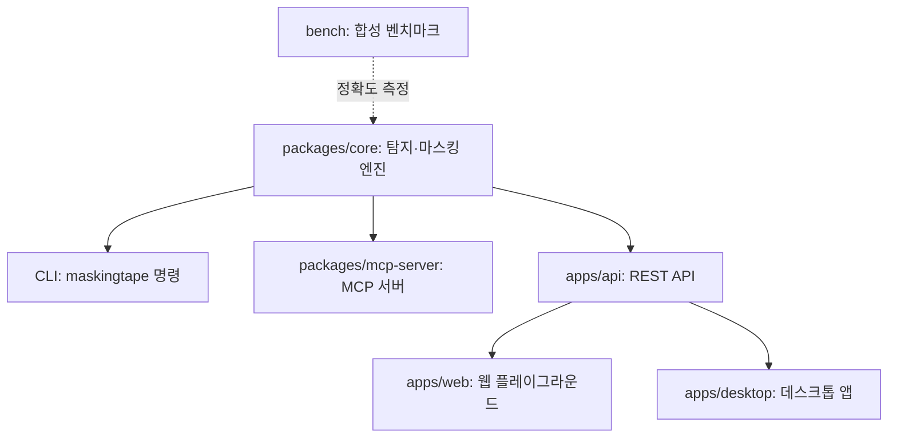

# 마스킹테이프 maskingtape

> 한국어 개인정보 비식별화 오픈소스 엔진 — 규칙 기반 탐지 + 로컬 LLM 문맥 판단 하이브리드

한국어 문서·데이터셋에서 개인정보(주민등록번호·전화번호·주소·이름 등)를 탐지해 마스킹·가명처리하는 **Python 라이브러리 + CLI + MCP 서버**.
AI 에이전트가 한국어 데이터를 다루기 전에 거치는 **프라이버시 계층**을 목표로 한다.

**[라이브 데모](https://maskingtape-lilac.vercel.app)** · **[PyPI](https://pypi.org/project/maskingtape/)** (`pip install maskingtape`) · **[개발 로드맵](ROADMAP.md)** · **[기여 가이드](CONTRIBUTING.md)**

**2026 오픈소스 개발자대회**(과학기술정보통신부 주최·NIPA 주관) 출품작 — 팀 **마스킹테이프** · Apache-2.0

## 왜 maskingtape인가

- **한국어 전용**: 주민등록번호(체크섬 검증 포함)·한국 전화번호·도로명 주소·한국어 이름 등 국내 포맷 특화 — 영어권 도구(Presidio 등)가 못 채우는 갭
- **하이브리드 탐지**: 정규식·사전 규칙(빠름, 결정적) + 로컬 LLM 문맥 판단(인명 vs 상호명 구분 같은 애매한 케이스, 선택 사항)
- **완전 로컬**: 외부 API 호출 없음. LLM도 Ollama 기반 오픈웨이트 모델만 사용 — 개인정보가 밖으로 나가지 않는다
- **규칙 전용 모드**: LLM 없이도 동작 — 저사양 환경에서도 쓸 수 있다
- **MCP 서버**: AI 에이전트 워크플로에 비식별화 계층을 끼워 넣을 수 있다

## 빠른 시작

**필요한 것: Python 3.10 이상.** 그게 전부다 — 코어 엔진과 CLI는 표준 라이브러리만 쓰고, 외부 서비스도 부르지 않는다.

```bash
pip install maskingtape

maskingtape "주민번호 800101-1234560 문의주세요"
# → 주민번호 ************** 문의주세요

maskingtape --strategy label "연락처 010-1234-5678"        # → 연락처 [전화번호]
maskingtape --scan "주민번호 800101-1234560 문의주세요"   # 탐지 리포트(JSON)만
```

소스로 받아 개발하려면(테스트·린트 포함):

```bash
git clone https://github.com/ChoHyeonChan/maskingtape.git
cd maskingtape && pip install -e "packages/core[dev]"
pytest packages/core
```

> **설치는 항상 개별 패키지 경로로 한다** — 저장소 루트에는 배포용 `[build-system]`이 없어(uv 워크스페이스 전용) `pip install .`은 루트에서 실패한다. 위 예시처럼 `packages/core`, `packages/mcp-server`, `apps/api`를 각각 지정하면 된다.

로컬 LLM 기능은 선택 사항이며 설치 방법은 [packages/core](packages/core)에 있다. 웹 데모는 Node.js 20+, 데스크톱 앱은 Flutter가 추가로 필요하며 각 폴더 README를 참고한다.

현재 탐지(11종): **주민등록번호**(체크섬 검증), **전화번호**(휴대폰·유선·070·050X, +82 표기), **이메일**, **주소**(행정구역·도로명), **신용카드**(Luhn 검증), **계좌번호**, **사업자등록번호**, **여권번호**, **생년월일**, **운전면허번호**, **이름**(규칙 + 로컬 LLM 문맥 판단)

라이브러리로 쓰기:

```python
from maskingtape import Pipeline

result = Pipeline().anonymize("주민번호 800101-1234560 문의주세요")
print(result.text)         # 주민번호 ************** 문의주세요
print(result.detections)   # [Detection(kind='rrn', start=5, end=19, ...)]
```

※ 예시의 주민등록번호는 체크섬만 맞춘 **합성 번호**다.

### 마스킹 방식 세 가지

| 방식 | 결과 | 쓰는 자리 |
|---|---|---|
| `mask`(기본) | `주민번호 **************` | 값을 완전히 지울 때 |
| `label` | `주민번호 [주민등록번호]` | 무엇이 있었는지는 남겨야 할 때 |
| `pseudonym` | `주민번호 310615-4145804` | 문장 구조를 살려 LLM 전처리·데이터셋 공유에 넘길 때 |

가명처리는 "그럴듯한 가짜 값"이라 **실존 정보와 겹치지 않는지**가 곧 안전성이다.
세 가지를 설계에 박아 뒀고, 아래는 전부 실제로 돌려 확인한 값이다.

- **전역 결정적 매핑을 두지 않는다.** 같은 입력을 두 번 돌리면 다른 가명이 나온다.
  "같은 원본 → 항상 같은 가명"을 두면 그 매핑 테이블 자체가 원본 복원 수단이 된다.
- **주민등록번호·카드번호는 체크섬을 일부러 통과하지 않게 만든다.** 진짜 탐지기의 검증
  함수를 재사용해 "검증하면 가짜"임을 보장한다 — 300회 생성한 가짜 주민등록번호 중
  체크섬 통과 **0건**, 가짜 카드번호 중 Luhn 통과 **0건**. 유효한 번호를 만들어 내면
  실존 인물의 것과 겹치거나 그 자체로 악용될 수 있다.
- **한 번의 호출 안에서는 같은 원본이 같은 가명으로 바뀐다.** `김소연 대리와 김소연 과장`
  → `신채원 대리와 신채원 과장`. "그 사람"이라는 문맥은 살아 남는다.

그래도 생성된 값은 형식이 그럴듯해 실제 정보와 우연히 닮을 수 있다. **반드시 가짜
데이터로만 취급한다.**

## 정확도 (공개 벤치마크)

저작권·개인정보 걱정 없는 **자체 합성 데이터셋**으로 정확도를 측정한다 — 공개 벤치마크는 이 프로젝트의 핵심 차별화 포인트다. 아무나 다음 한 줄로 재현할 수 있다:

```bash
python -m bench.evaluators.evaluate bench/datasets/synth_v1.jsonl
```

합성 데이터셋(500건)도 시드로 고정돼 있어 바이트 단위로 똑같이 재생성된다 — `python -m bench.generate_dataset --count 500 --seed 42 --out bench/datasets/synth_v1.jsonl`

**측정 기준: #370 병합 시점 main · 규칙 전용 모드(LLM 미사용)** — #339/#340이 추가한 표기 변형(en-dash·"공백-하이픈-공백"·"번지" 리터럴·양/군 끝음절)이 데이터셋에 반영된 재측정값이다

| 종류 | precision | recall | F1 |
|---|---|---|---|
| 주민등록번호 | 1.000 | 1.000 | 1.000 |
| 전화번호(휴대폰+유선+050X) | 1.000 | 1.000 | 1.000 |
| 이메일 | 1.000 | 1.000 | 1.000 |
| 주소 | 1.000 | 1.000 | 1.000 |
| 신용카드번호 | 1.000 | 1.000 | 1.000 |
| 사업자등록번호 | 1.000 | 1.000 | 1.000 |
| 여권번호 | 1.000 | 1.000 | 1.000 |
| 계좌번호 | 1.000 | 1.000 | 1.000 |
| 생년월일 | 1.000 | 1.000 | 1.000 |
| 운전면허번호 | 1.000 | 1.000 | 1.000 |
| 이름 (규칙 전용) | 0.859 | 0.668 | 0.752 |
| **전체** | **0.954** | **0.872** | **0.911** |

번호·카드·사업자등록번호·여권번호·계좌번호·생년월일은 형태(와 있는 경우 체크섬)로 완전히
잡힌다(유선전화·plus 이메일·서브도메인·여러 문장으로 구성된 복합 문서까지 섞어도 흔들리지
않음을 확인했다) — 사업자등록번호는
[#123](https://github.com/ChoHyeonChan/maskingtape/issues/123), 여권번호는
[#139](https://github.com/ChoHyeonChan/maskingtape/issues/139), 계좌번호는
[#180](https://github.com/ChoHyeonChan/maskingtape/issues/180), **생년월일**은
[#266](https://github.com/ChoHyeonChan/maskingtape/issues/266)/[#271](https://github.com/ChoHyeonChan/maskingtape/pull/271)에서
각각 새 kind를 추가해 측정 사각지대를 없앴다 — 생년월일은 10번째 kind이자 계좌번호와 같은
문맥 앵커 하드 게이트 설계라, confidence가 **항상 정확히 0.9로 고정**된다(임계값 0.91
이상이면 100% 소실, 아래 참고). **운전면허번호**는 [#267](https://github.com/ChoHyeonChan/maskingtape/issues/267)에서
core가 추가한 11번째 kind로, 체크섬이 비공개라 형식+지역코드(11~26·28)만으로 판단해
confidence가 **항상 정확히 0.85로 고정**되고 — 계좌·생년월일과 달리 **문맥 앵커 게이트조차
없다.** 즉 우연히 유효 지역코드로 시작하는 임의의 12자리 숫자는 문맥과 무관하게 무조건
운전면허번호로 오탐된다는 뜻이라, [#315](https://github.com/ChoHyeonChan/maskingtape/issues/315)에서
벤치 데이터를 채우다가 계좌번호 생성기 자신의 출력(구분자 없는 12자리)이 정확히 이 경계에
두 번 걸리는 걸 실측으로 찾았다 — 한 번은 이 운전면허 지역코드 자체와, 한 번은 우연히도
core `PhoneDetector`의 050 평생번호 정규식과. 둘 다 생성기에 회귀 가드를 추가해 항상
피하도록 고쳤다(카드 Luhn 우연 통과 가드와 같은 패턴). 주소는 [#195](https://github.com/ChoHyeonChan/maskingtape/issues/195)/[#196](https://github.com/ChoHyeonChan/maskingtape/issues/196)에서
시/도명 뒤 **조사** 미탐 버그를, [#248](https://github.com/ChoHyeonChan/maskingtape/issues/248)에서
**계사 어미**("입니다"/"예요") 미탐도 찾아 core [#252](https://github.com/ChoHyeonChan/maskingtape/pull/252)가
전부 고쳐 recall이 1.000으로 완전히 복구됐다(직접 재확인함). 주민등록번호는 [#159](https://github.com/ChoHyeonChan/maskingtape/issues/159)에서
체크섬 없는(2020-10 이후 발급분) 케이스, [#209](https://github.com/ChoHyeonChan/maskingtape/issues/209)에서
점(.) 구분자 표기도 섞었는데 precision/recall엔 영향이 없다 — core가 형식만으로 탐지 자체는
하기 때문(체크섬 없는 케이스는 confidence가 0.85로 낮아져 임계값 필터를 쓰면 새기 쉽다,
[bench/](bench/) 참고). 전화번호는 [#211](https://github.com/ChoHyeonChan/maskingtape/issues/211)에서
050X 평생번호·안심번호도 새로 잡게 됐다. 계좌번호는 core `AccountDetector`가 문맥어(계좌/입금/은행 등)가
없으면 아예 탐지를 안 하는 하드 게이트인 데다, 체크섬이 없어 confidence가 **항상 정확히 0.6으로
고정**된다 — confidence 임계값을 0.7 이상으로만 올려도 계좌번호가 전량 걸러진다는 걸 확인했다
([bench/](bench/) 참고). 여권번호는 core에 체크섬 검증이 없어(형식+문맥어만으로 판단) distractor가
우연히 형식과 겹치지 않는지 별도 회귀 테스트로 고정해뒀다. 이름 규칙판은 [#213](https://github.com/ChoHyeonChan/maskingtape/issues/213)(직함이
이름 뒤)·[#239](https://github.com/ChoHyeonChan/maskingtape/issues/239)(직함이 이름 앞) 둘 다
지원하게 됐고, 그 오탐 방지 가드가 조사에 뚫리던 버그([#247](https://github.com/ChoHyeonChan/maskingtape/issues/247))도
core [#252](https://github.com/ChoHyeonChan/maskingtape/pull/252)가 고쳤지만 **완전히는 아니다**
— 하드코딩 5개 부서어만 막는 방식이라, 그 밖의 흔한 업무어("차량"/"허가" 등)는
[#255](https://github.com/ChoHyeonChan/maskingtape/issues/255)에서 여전히 뚫리는 걸 확인했다
(negative 문서의 상당수에서 재현) — 그 결과 precision이 규칙판 F1 개선 이전 수준으로 다시
떨어졌다(precision 0.859) — 남은 과제는 문맥 없는 이름뿐이다:

- **이름** — 한국어 이름은 형태만으로 구분되지 않아 규칙만으로는 문맥 없는 이름을 놓친다. 이것이 **로컬 LLM 하이브리드**(`--llm`)가 필요한 이유이고, 그 효과는 [#46](https://github.com/ChoHyeonChan/maskingtape/issues/46)에서 같은 데이터셋으로 비교 측정한다 — 하이브리드로 켜면 recall이 **0.668 → 0.927**로 오르고, precision도 규칙판보다 높다(0.859 → 0.920, F1 0.752 → 0.923) — 로컬 Ollama(qwen2.5:7b)로 현재 데이터셋(#339/#340 반영본) 재측정, 상세는 [bench/](bench/) 참고. ※ LLM 판단은 결정적이지 않아 재현 시 소수점 셋째 자리가 흔들릴 수 있다(규칙 전용 지표는 결정적이라 그대로 재현된다).

마스킹 결과에 개인정보가 실제로 남는지도 따로 측정한다 — `python -m bench.evaluators.evaluate_masking bench/datasets/synth_v1.jsonl`. 상세는 [bench/](bench/) 참고.

## 지원 범위와 한계

비식별화 도구에서 **못 잡은 하나는 그 자체로 유출**이다. 그래서 무엇을 보장하고 무엇을
보장하지 않는지 먼저 밝힌다. 아래 미탐 표기는 전부 직접 실행해 확인한 값이다.

| | 지원 | 지원하지 않음 |
|---|---|---|
| **입력 형식** | 텍스트(str) | docx·이미지. PDF는 웹 데모에서 텍스트 추출만 |
| **탐지 종류** | 11종(주민등록번호·전화·이메일·주소·카드·계좌·사업자번호·여권·생년월일·운전면허·이름) | 그 밖의 식별자(사번·학번·차량번호·IP 등) |
| **이름** | 로컬 LLM(`--llm`)을 켜면 F1 0.923 | 규칙 전용은 재현율 0.668 — **셋 중 하나를 놓친다** |
| **언어** | 한국어 표기를 전제로 설계 | 영문·중문·일문 이름과 주소 |

### 알려진 미탐 표기

지금 놓치는 표기를 그대로 적어 둔다. 각각 탐지기 한 파일만 고치면 되는 일이라,
**기여를 시작하기 좋은 지점**이기도 하다([기여 가이드](CONTRIBUTING.md)).

| 놓치는 입력 | 잡히는 입력 | 종류 |
|---|---|---|
| `서울 강남구 테헤란로 123` | `서울특별시 강남구 …` / `서울시 강남구 …` | 주소 — 시/도 축약형 |
| `부산 해운대구 센텀중앙로 79` | `부산광역시 해운대구 …` | 주소 — 시/도 축약형 |
| `(010) 1234-5678` | `010-1234-5678` / `01012345678` | 전화 — 괄호 표기 |
| `1234567891` | `123-45-67891` | 사업자등록번호 — 구분자 없음 |
| `m12345678` | `M12345678` | 여권 — 소문자 |
| `95.03.22` | `1995년 3월 22일` | 생년월일 — 2자리 연도 |
| `홍길동@example.com` | `hong@example.com` | 이메일 — 한글 로컬파트 |

구분자 없는 사업자등록번호(10자리 연속 숫자)는 다른 숫자와 구분이 어려워 **의도적으로**
잡지 않는다. 나머지는 앞으로 넓혀 갈 대상이다.

### 정확도 수치를 읽는 법

위 표의 F1 1.000은 **이 저장소의 합성 생성기가 만든 표기**에 대한 값이다. 생성기가 코어의
형식 검증 코드를 그대로 가져다 쓰기 때문에, 구조화된 10종의 1.000은 "탐지기가 아는 형식을
정확히 그 경계까지 잡아내는가"를 보는 **자기일관성 지표**에 가깝다. 실세계 표기의 다양성을
모두 담지는 못한다. 자세한 내용은 [bench/README.md](bench/README.md)의 한계 고지를 참고한다.

## MCP 서버로 쓰기 (AI 에이전트용)

에이전트가 한국어 데이터를 외부로 보내기 전에 자동으로 비식별화하는 프라이버시 계층:

```bash
pip install -e packages/core -e packages/mcp-server
claude mcp add maskingtape -- maskingtape-mcp      # Claude Code 등록
```

제공 도구: `scan_text`(탐지 리포트), `anonymize_text`(mask/label/pseudonym 비식별화), `anonymize_file`(로컬 파일을 통째로 비식별화해 사본 저장). 상세: [packages/mcp-server](packages/mcp-server)

## 저장소 구조

모든 탐지·마스킹 로직은 `packages/core` **하나**에 있고, 나머지는 그걸 감싸 쓴다 — 탐지기를 한 번 고치면 모든 표면(CLI·MCP·API·앱)이 함께 좋아진다.


```mermaid
flowchart TD
    core["packages/core: 탐지·마스킹 엔진"]
    core --> cli["CLI: maskingtape 명령"]
    core --> mcp["packages/mcp-server: MCP 서버"]
    core --> api["apps/api: REST API"]
    api --> web["apps/web: 웹 플레이그라운드"]
    api --> desktop["apps/desktop: 데스크톱 앱"]
    bench["bench: 합성 벤치마크"] -.->|정확도 측정| core
```

> 웹은 `apps/api`를 거쳐 동작한다. 데스크톱은 로컬 CLI를 우선 쓰고, CLI가 없으면 `apps/api`로 넘어간다.
> **로컬에서 웹을 띄울 때는 API 백엔드도 함께 띄워야 한다** — 아래 [웹 플레이그라운드 로컬 실행](#웹-플레이그라운드-로컬-실행) 참고.

### 웹 플레이그라운드 로컬 실행

웹은 `/api`를 REST 백엔드로 프록시한다. **터미널 두 개**가 필요하다.

```bash
# 터미널 1 — API 백엔드 (기본 포트 8000)
pip install -e "packages/core" -e "apps/api"
python -m uvicorn maskingtape_api.main:app --app-dir apps/api --port 8000

# 터미널 2 — 웹
cd apps/web && npm install && npm run dev      # http://localhost:5173
```

다른 포트에 API를 띄웠다면 `VITE_API_TARGET`으로 알려준다 (예: `VITE_API_TARGET=http://127.0.0.1:8001 npm run dev`).

| 경로 | 내용 | 담당 |
|---|---|---|
| `packages/core/` | Python 탐지·마스킹 엔진 + CLI (순수 로직) | [@ChoHyeonChan](https://github.com/ChoHyeonChan) |
| `packages/mcp-server/` | MCP 서버 — core를 에이전트 도구로 노출 | [@ChoHyeonChan](https://github.com/ChoHyeonChan) |
| `apps/api/` | FastAPI 백엔드 — 웹·데스크톱 공용 | [@kitae13](https://github.com/kitae13) |
| `apps/web/` | 웹 플레이그라운드 (탐지 하이라이트 데모) | [@plana1470](https://github.com/plana1470) · [@imsoo0816](https://github.com/imsoo0816) |
| `apps/desktop/` | Flutter 데스크톱 앱 (드래그&드롭 배치 처리) | [@stayalive000](https://github.com/stayalive000) |
| `bench/` | 합성 벤치마크 데이터 + F1 정확도 리포트 | [@seoyeon056](https://github.com/seoyeon056) |

## 개발에 참여하기

- **[CONTRIBUTING.md](CONTRIBUTING.md)** — 협업 규칙 (이슈 → 브랜치 → PR → 머지). AI로 작업한다면 이 파일부터 읽히세요.
- **[STRUCTURE.md](STRUCTURE.md)** — 폴더 구조 규칙 (기능·도메인별로 나눕니다)
- **[ROADMAP.md](ROADMAP.md)** — 개발 계획과 현재 정확도
- **[CLAUDE.md](CLAUDE.md)** — 대회 규정에서 나온 필수 규칙 (위반 시 팀 전체 실격)
- 진행 상황: [Issues](https://github.com/ChoHyeonChan/maskingtape/issues) · [Milestones](https://github.com/ChoHyeonChan/maskingtape/milestones)
- 의존성을 추가할 땐 같은 PR에서 [SBOM.md](SBOM.md)를 갱신합니다.

## 라이선스

[Apache-2.0](LICENSE). 사용한 모든 의존성의 출처·라이선스는 [SBOM.md](SBOM.md)에 기록한다.
